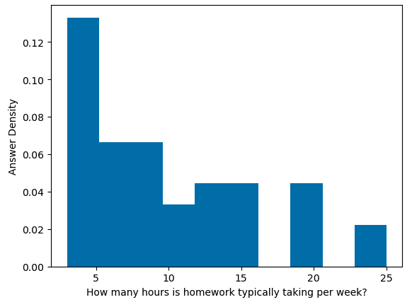

<!-- JPN: also check links to all external images -->

## Land Acknowledgment

Please see the Land Acknowledgment in the Syllabus.

[More information can be found on the Chancellor's
Website.](https://chancellor.illinois.edu/land_acknowledgement.html)

notes:
we are on a land-grant institution, please see the link on the chancellors page for more info about thi

---

## COVID-19 Policies

Please see the statement about policies related to COVID-19 at the [top of the Syllabus](https://uiuc-ischool-dataviz.github.io/is445_bcubcg_fall2023/syllabus.html).

---

## Class Size Notes

60 for this course!

**Strategies:**
 * a total of >12 hours of office hours (Prof+TA's) every week 
 * utilize Slack for general question/answer (can be across sections!)
 * group options for final project

notes:
so, we have 60 students in this class, this is a large class!

we will go over some of these strategies in detail, but I wanted to give you an overview of somethings that we are doing to cover everybody AND some things you can do to help us and your fellow classmates out

the first thing is we have an extra >12 hours of help time outside of class to answer questions in the form of office hours (more details next slide) 

also, we will have a Slack channel (more on that in a moment) where you can get more quick responses from the instructional team if you post in the channel for a specific homework or (less ideal) #general channel

finally, we have several assignments that can be turned in as a group to allow for collaboration between folks in the class -- we'll talk about those assignments as we come to them

---

<!-- .slide: class="vertical_center" -->
## Basics

Jill P. Naiman - `jnaiman@illinois.edu`
 * Office Hours: Wed 11am-12:30pm (online)
 
TA: Leon Hounnou - `hounnou2@illinois.edu`
 * Office Hours: Tues & Thurs 11amo-12pm, Fri 4-6pm (online)

TA: Qiuyan Guo - `qqguo2@illinois.edu`
 * Office Hours: Mon, Tues, Wed, 8am-10am (online)

Course website: https://uiuc-ischool-dataviz.github.io/is445_bcubcg_fall2023/

notes: 

Here are some of those hours of office hours for you.  We are still working on finalizing this and will add some more!

So you see that we have LOTS of office hours throughout the week -- this is with the idea that folks may be in and out of class as illness/etc happens (but hopefully doesn't!)

**TA's introduce themselves if they are on Zoom**

Again, we want to make sure there are lots of support for folks that have questions

Note that we have a shared canvas space across two sections (more on that in a moment) but seperate webpages where materials are

Now, the website!
**go through website!!**

---

## In summary: where things will be located:

 * Canvas: https://canvas.illinois.edu/courses/37444 - where the grades and assignments links will be posted
 
 * PrairieLearn: https://us.prairielearn.com/pl/course_instance/137563 - where assignments will be completed

 * Course webpage: https://uiuc-ischool-dataviz.github.io/is445_bcubcg_fall2023/ - where lecture slides, notebooks, data & general course info will live.

 * Slack: https://is445-fall2023.slack.com/ - the best place to ask questions in a `#homeworkX-questions` channel (or the `#general` channel for general questions)
 
notes:

A few notes about this semester -- while assignments will be posted on Canvas, the actual completion of the assignments will take place on the PrairieLearn platform.  We will discuss this in more detail when we get to looking at homework stuff, but in short these will be "online" cloud notebooks that have all the packages you need already installed so you don't have to install (too many) things on your local machine

Also, we will be utilizing Slack for discussing homeworks with a dedicated channel for each assignment. Again, more on this when we get to looking at the homework (as part of your homework is to say hi on slack!)

---

## Questions:

* Who are you?
* What are we doing?
* How are we going to do it?

---

## Questions:

* Who are you?
* What are we doing?
* How are we going to do it?

---

### My background

<!---->

---

### My background

---

### My background

---

### My background

---

### My background
#### ytini.com

Naiman et al. 2017, Borkiewicz et al. 2018

---

### My background
#### ytini.com

Naiman et al. 2017, Borkiewicz et al. 2018

---

### My background
#### ytini.com

Naiman et al. 2017, Borkiewicz et al. 2018

---

### My background
#### ytini.com

Naiman et al. 2017, Borkiewicz et al. 2018

---

### My background
#### Scientific Digitization

Naiman et al. 2022, TPDL conference

notes:
also do some science digitization, i.e. trying to turn scans of old scientific figures back into data by having computers "read" objects and axis labels using image processing, optical character recognition and machine learning methods

---

## Timed activity! (~2 minutes)

On a piece of paper or in notes on your computer:

* What are the most memorable movies you saw over the last year?
* Do you prefer cats or dogs?
* How would you quantify your experience in visualization?
* How many hours do you spend online in classes each week?

notes:
We're going to use these pieces of data to explore how we might approach
visualization.  Each of these items is a different *type* of data --
qualitative, quantitative, elements drawn from sets, and sets of numerical
data.

Trying to visualize each one will give us a basic idea of how we might think
about these types of data, and how we approach visualizing them.

---

## In a group of ~4-5 people

Visualize the results of your group's collective "data".

* What are the most memorable movies you saw over the last year?
* Do you prefer cats or dogs?
* How would you quantify your experience in visualization?
* How many hours do you spend online in classes each week?

Don't forget to say hi to eachother!

<!--
* Jamboard 1 (Groups 1-10): https://jamboard.google.com/d/1JdXo144A0BIAb1wzeGU-5p_Sgfp5t3yCtu2hjRLSUnk/edit?usp=sharing
 * Jamboard 2 (Groups 11-20): https://jamboard.google.com/d/1nBi0qz9Dbk_qBJa5F8ClJzW0pB__2PriRWhYThs4UTs/edit?usp=sharing 

**There is a limit of 50 people per jamboard, so make sure you match your breakout group number.**

**You must be signed in with your @illinois.edu address.**
-->

notes:

What was easy/hard about visualizing the various datasets?  How did you do it?

Feel free to do this on your own if you are more comfortable that way.

---

 
 
 

# Bureaucracy, continued

We have to do it!

---

## Syllabus

 * Week 1 (Today) - Introduction
 * Week 2 - Data Storage and Operations
 * Week 3 - Types of Viz and Choosing Colors
 * Week 4 - Beginning interactivity
 * Week 5 - Continuing interactivity with bqplot
 * Week 6 - More with dashboards & Map Viz (**possible flipped class, Prof. Jill out of town**)
 * Week 7 - Maps, maps and more maps
 
notes:
This is a rough syllabus!  These are many of the topics we will cover, but
based on how the course proceeds and how folks respond, we may shorten or
lengthen different topics.

The organization here is designed to start out slow, dealing with how to
program python for visualization, understanding how data is laid out, which
operations we can apply to that data, and then moving on to representing data
in different ways.

We might start getting into javascript earlier, depending on how we are doing.

**be aware**: that we are trying out some "flipped" classes for this semester around the harder assignments so folks can get extra help -- this will happen around Week 6 and the final projects.  This just means that you are expected to watch the recording *before* the class and then come to the class with quesstions about the assignment. 

Also, I will be out of town during Week 6 so we might move some due dates of assignments around and/or have extra office hours that week with the TA's

---

## Syllabus, cont

 * Week 8 - Starboard and Intro to Javascript
 * Week 9 - Viz Audience; More Starboard/Observable, Javascript & Vega-lite
 * Week 10 - Intro to Jekyll
 * Week 11 - More with Jekyll+Altair, Publishing Viz
 * Week 12 - A few more Jekyll+Altair+vega-lite things
 * Week 13 - More Jekyll+Altair+vega-lite things
 * Week 14 - Fall break, no class!
 * Week 15 - Scientific Viz & AVL Guest lecture (**partially flipped class**)
 * Week 16 - Network Visualization & Word clouds (**probable flipped class**)

notes:
Toward the end of class we are going to have a slightly more free-form set of
discussion points.  Your final projects will be somewhat open-ended, requiring
more group work and collaboration than the preceding assignments.

Here the weeks get a little off between the in-person and online classes because of the election day holiday and this is also reflected in the Canvas page.  We'll be working on final project stuff then, so it shouldn't be an issue too much.

---

## Syllabus: In summary

 * Weeks 1-5: Basics of visualization (Python)
 * Weeks 6-10: Interactivity and Viz Types (Python and Javascript)
 * Weeks 11-16: Platforms and dimensionality (Python, Javascript, Web-dev methods)

notes:
basically, we'll start with the basics - I'm assuming you are coming in with Python experience

---

## Assumptions about Python experience

IS430 + a programming project

or 

IS205 + one more Python-based programming class

or

Equivalent informal Python background

notes:
so what do I mean by "python experience"?  Here are some rough guidelines for courses

Since there are no enforced pre-reqs, you can also get Python experience in industry as well

Basically, I'm expecting that you understand all the logical operations like if-then, for loops, are comfortable using external libraries, and reading/writing and manipulating data to some extent -- check out the prep notebooks for the level that is expected

I am also expecting that you have some experience not just doing python homeworks assigned in a class, but also doing a small project on your own where you had to practice some debugging, looking up answers on stackoverflow, etc

also be aware: as this is a graduate-level course, the homeworks will build on concepts we cover in class but may require extra out-of-class work on your behalf in cluding, but not limited to, coming to office hours and/or reaching out on slack

---

## Assumptions about Python experience

IS430 + a programming project

or 

IS205 + one more Python-based programming class

or

Equivalent informal Python background

Extra coding help: https://ischool.illinois.edu/student-life/academic-support-center (see Tutoring by Subject and Skill)

notes:
that being said, I have had students that were just starting off in their programming journeys be successful in this class, but just be aware its going to require extra time commitement

In addition to all of the hours of office hours, you should check out the academic support center, in particular the Tutoring by Subject and Skill where you can find Python tutors

---

## Assumptions about Python experience

IS430 + a programming project

or 

IS205 + one more Python-based programming class

or

Equivalent informal Python background

Extra coding help: https://ischool.illinois.edu/student-life/academic-support-center (see Tutoring by Subject and Skill)

If you already know a good bit of viz for the web - check out [IS545, Advanced Data Visualization](https://ischool.illinois.edu/degrees-programs/courses/is545).

notes:
this course is NOT meant for folks that have already been doing a lot of data viz for a while, and who have been using web visualization tools like react, etc for a while.  If that is you, what you probably want to take is the advanced data viz class, IS545

---

## Assumptions about your computer setup

New-ish computer

Have been keeping it updated to most recent-ish operating system

(If not, just let us know!)

notes:
Assignments will *mostly* be done on the PrairieLearn platform, however there will be a few things you need to install locally, so there are some assumptions I am going to make about the computer you are using for this class.

1. I'm assuming it is a new-ish computer -- what does this mean?  This means purchased in the past few years, but there is a question on the intake survey with specifics
1. I'm also assuming you've been keeping your computer up to date with the most recent operating system available for your system.  How recent?  Again, this is not a hard and fast cut off I have in my mind, and the intake survey will have more detailed questions, but basically, if you haven't updated your OS in a year or more, you might run into issues in this class with several of the assignments

Now if you do have an older computer or haven't updated the OS in a while, please reach out to us ASAP!  This doesn't mean you can't take this class, but it does mean we might need to get you a loaner laptop or see about having IT update your OS for you.

---

## How much work in this class?

notes:
ok, a few questions I sometimes get asked, starting with how much work is this class?

be aware that this was from a survey that generally happens ~1/2 way through the course, so later parts of the course might take more effort

some folks find the HW doesn't take that long, but others do say it takes longer -- I suspect this has to do with Python/programming background but since I didn't want identifying info in the survey I can't be certain

---

## Why aren't we learning viz software X?

This is an *introduction* to data visualization - we will focus on the *fundamentals that underlie* all visualization tools.

notes:

another question I get asked a lot is why aren't we learning Tableau or PowerBI or whatever the data viz software "flavor of the moment" is that we want to 
not only understand how to make visualizations but *what design choices and data links are necessary* to create data visualizations.

---

## Why aren't we learning viz software X?

This is an *introduction* to data visualization - we will focus on the *fundamentals that underlie* all visualization tools.

(and we are focused on open source tools)

notes:

Plus we are focusing only on open source tools

---

## Why aren't we learning viz software X?

This is an *introduction* to data visualization - we will focus on the *fundamentals that underlie* all visualization tools.

(and we are focused on open source tools)

... but check out:

 * [Tableau videos on MediaSpace](https://mediaspace.illinois.edu/tag/tagid/tableau) and Prof. [Wonderlich](https://ischool.illinois.edu/people/michael-wonderlich)'s courses. (Though, you might want to [check out some of the press](https://www.geekwire.com/2023/tableau-has-been-killed-by-salesforce-past-and-current-tableau-employees-gather-at-irish-wake/) about the future of development of Tableau.)
 * [R/PowerBI](https://www.coursera.org/programs/coursera-for-illinois-gp2ja/learn/tools-exploratory-data-analysis-business) Coursera courses (that you get for free as a UIUC student!)

notes:

Some of the most common I get asked about are Tableau and PowerBI - if you already have an introduction to data viz and have built some of your own tools "from scratch" and just want to learn some new software here are some links for Tableau tutorials and PowerBI tutorials that you have access to as a UIUC student

Though do check out the press about the Tableau lay offs and decide if you want to put in the time to learn this software -- of course having the background data viz that you will learn in this course will help you jump between software when one tool breaks!

---

## Structure of Class

 * Topic introduction and lecture (~60-80 minutes) (usually Tuesday)
 * Hands-on, in class coding (Tuesday/Thursday)
 * Lab time (usually Thursday)
 * Wrap-up (as needed)

(Today will be a little lecture heavy)

**Some classes will be flipped!**

notes:
This structure will likely be deviated from during the course, but in general
we will start with lecture, then continue with collaborative or
hands-on exercises using group coding.  
We will try to have a little 5 minute break in class for folks to stretch/run to the bathroom.

During the group coding, I might lead the class in some visualization in
Python, Javascript, or something else.  During this section, I expect that
students will *follow along* with what is going on -- typing in the specific
commands, and maybe even trying different things as we go.  It is not meant to
simply be a "performance" of coding, but instead an opportunity to learn.

YOU HAVE THE NOTES BEFORE CLASS.

final reminder -- some of the classes will be flipped!

---

## Grading

 * 45% Standard assignments in prose or code form (see syllabus for some details about "required" assignments)
 * 20% Lab assignments which allow for "real time" checking of answers and feedback
 * 5% Quizzes on the material covered in class
 * 30% Final project ([teaser trailer](https://jnaiman.github.io/online_cv_public_demo/))

notes:
Your weekly-idh assignments will take different forms.  The first assignment will
be mostly some "getting to know prairielearn" assignments and test installations, but subsequent assignments will be
either notebook (coding) based or prose-based as well.

Labs will be jupyter notebook and coding based, however you can get "instant" feedback on your submission and 
hints for how to update your assignment if you do not get full points.

The final project will be described later in class, but will take the form of a
group project that touches on coding as well as visual design.

---

## Grading

 * 45% Standard assignments in prose or code form (see syllabus for some details about "required" assignments)
 * 20% Lab assignments which allow for "real time" checking of answers and feedback
 * 5% Quizzes on the material covered in class
 * 30% Final project ([teaser trailer](https://jnaiman.github.io/online_cv_public_demo/))
 
**We will drop the lowest homework score, however there are some required assignments.**

notes:

part of the syllabus quiz will be checking out the HW policies in more detail -- we will drop the lowest HW score, however there 
are several assignments you must submit and get above a certain grade on to pass the class -- these are installation assignments 
and those that are considered "prepratory" for the final project

---

## Homeworks Summary

 * Mix of prose and code
 * Assigned on Canvas, completed on PrairieLearn (usually) - more on this later
 * Grading done by the instructional team (with occasional feedback from PrairieLearn)
 * Two extra credit options, assigned toward end of class
 * 45% of grade (maximum, including extra credit), lowest score dropped except for required assignments
 * A total of 9 Homeworks in the course
 
notes:
Just a few more details about homework type assignments

---

## Labs Summary

 * Code only
 * Assigned on Canvas, completed on PrairieLearn
 * Grading done "automatically" on PrairieLearn - see example autograding in Homework 1
 * Can be attempted multiple times before the due date 
 * 20% of grade, no assignments dropped
 * 4-5 Labs in the course (4 now, another might be added later)
 
notes:
Again, we'll discuss Labs more later in the week/next week, but the take away is that these are meant to be ways for you to practice coding/viz skills and get automatic feedback.

We will also have time in class, typically on Thursdays, for you to work on these assignments.

---

## Quizzes Summary

 * Cover material that is covered in class
 * Short answer/multiple choice
 * Graded automatically on PrairieLearn
 * Can be attempted multiple times *with decreasing scores*
 * ~12 Quizzes in the course
 
notes:
Quizzes are meant to be quick checks of the material covered in class

You can repeat quiz questions multiple times, however you will be peanalized for wrong answers, so be sure that you aren't just guessing on these!

These are still being developed, but we expect there to be about 12 throughout the course

---

## _Optional_ reading assignments

See the course syllabus: 

https://uiuc-ischool-dataviz.github.io/is445_bcubcg_fall2023/syllabus.html

notes:
These are TOTally optional - more on that in a minute.

---

## Plagiarism

 * Plagiarism is about copying ideas.
 * Cite all code you utilize from elsewhere.
 
notes:
When programming, I expect that you will do things like search on the internet
to find help with a given problem.  This is fine.

But, you *must* cite where any code snippets came from.  And you *must* note if
you are working with other people in the group!

Using snippets of code is fine -- but you may not copy large-scale amounts of
code from other work (for example, other visualizations) and pass it off as
your own.  Always cite, and be reasonable in what you utilize.

---

## Our software/languages

 * Python, with some Javascript along the way
 * [Jupyter](https://jupyter.org/) & Jupyter notebooks
 * The occasional usage of a shell such as bash
 * Git & [GitHub](https://github.com/) (toward end of class)
 * [Starboard](https://starboard.gg/) 
 * Markdown & [Jekyll](https://jekyllrb.com/)
 * Slack

notes:
You will be expected to write code in Python, and to learn the very basics of
Javascript.  Your projects may be turned in via git.  We will also utilize
Slack for class communication.

These tools represent many different ways to explore and visualize data.  We'll
use a mix of local installations & web-services.

---

## Viz Systems We Will Cover

In approximate order:

 * [matplotlib](https://matplotlib.org)
 * [bqplot](https://bqplot.readthedocs.io)
 * [vega-lite](https://vega.github.io/vega-lite)
 * [Altair](https://altair-viz.github.io/index.html)

There'll be a few more along the way.

notes:
This class is not meant to teach you a given tool, but instead a way of
thinking about using visualization tools.  These tools are chosen because of
what they represent, not because they are the only paths to success.

---

## Slack

We will be sharing a slack channel with the in-person class, so feel free to
converse with them as well!

 * Team channel at `https://is445-fall2023.slack.com`
   * `#general` : General announcements, place to ask questions
   * `#random` : see a cool viz you want to share?  This is the place!
   * `#introduce-yourself` : where you want to "say hi" for Homework #1
   * `#ASSIGNMENTX-questions` : each assignment will have [a channel](https://slack.com/help/articles/205239967-Join-a-channel) for asking questions specific to that assignment

---

## Slack (cont)

 * Use the `@` sign appropriately: `@[person]`, `@here`, `@channel`
 * Web client, standalone client and mobile devices can access this team.
 * At the end of the semester, the team will be discontinued.
 * Please think carefully before direct messaging if you could ask in a public
   forum instead.
 * Conduct will be held to same standards as any educational venue.

notes:
Please use slack as much as you need!  You can use it to share items and
articles with the class, to collaborate, to discuss and ask questions and get
feedback.  However, please do behave in a professional fashion.

---

## Slack (cont)

 * Use the `@` sign appropriately: `@[person]`, `@here`, `@channel`
 * Web client, standalone client and mobile devices can access this team.
 * At the end of the semester, the team will be discontinued.
 * *Please think carefully before direct messaging if you could ask in a public
   forum instead.*
 * Conduct will be held to same standards as any educational venue.
 
Slack turn-around time ~24 business hours or less (general/section channel), email ~3 business days or less

Questions about grades should *always* be over email.

notes:
We aim for turn-around times for slack to be 24 hours or less when questions are posted to the general channel for others to see/comment on

personal questions (like about grades) should be over email

personal messages on slack will be treated as email and we'll get back to you within 3 days or less

---

## How do I access Slack?

 * Your @illinois email should be added, just go to: [https://is445-fall2023.slack.com](https://is445-fall2023.slack.com)
 * Send me an email with _your_ email

---

## Github

<!-- JPN: check all these links -->

 * Course repo is at [UIUC-iSchool-DataViz/is445_bcubcg_fall2023/](https://github.com/UIUC-iSchool-DataViz/is445_bcubcg_fall2023/) 
 * Automatically built to [uiuc-ischool-dataviz.github.io/is445_bcubcg_fall2023/](https://uiuc-ischool-dataviz.github.io/is445_bcubcg_fall2023/)  

notes:
All the materials for this course will be stored in github, and are available
under a very permissive license.  It is largely written in markdown and
automatically compiled to web pages when changes are made.

You are invited to clone the repo, fork and submit changes (typos, etc!), and
to use any information in it in the future.

---

## Choose your own adventure

There are 3 pathways (that I can see in this course, could be more!)

 1. "I am here to get better at programming and play with viz platforms"
 1. "I am thinking about a career in data viz."
 1. "I don't know/I am new to programming and I want to focus on that."

---

## Choose your own adventure

There are 3 pathways (that I can see in this course, could be more!)

 1. "I am here to get better at programming and play with viz platforms"
    * Strategy:
       * look at the code and the extended examples
       * do the Javascript/Jekyll parts

---

## Choose your own adventure

There are 3 pathways (that I can see in this course, could be more!)

 2. "I am thinking about a career in data viz."
    * Strategy: 
       * look at the code
       * do the Javascript/Jekyll parts
       * read the optional texts/docs 

---

## Choose your own adventure

There are 3 pathways (that I can see in this course, could be more!)

 3. "I don't know/I am new to programming and I want to focus on that."
    * Strategy: 
       * look at the code, focus heavily on Python
       * read the prep notebooks before class!
	   * look into some extra Python tutoring with the Academic Support Office
       * do the Javascript/Jekyll parts, think about joining a group for the final project
       * if you're new to programming, do Javascript/Jekyll parts in class, and build on them for any assignments
       * come back to the optional texts/docs after the course is over

---

## Other strategies for success

 1. Some assignments are assigned over 2 weeks - use full 2 weeks!
 1. There are extra credit opportunities, the max HW score is 45% (it might look like >45% because of how Canvas grades, but we will modify it for final grades)

---

## Other strategies for success

 1. Some assignments are assigned over 2 weeks - use full 2 weeks!
 1. There are extra credit opportunities, the max HW score is 45% (it might look like >45% because of how Canvas grades, but we will modify it for final grades)
 1. Start assignments early!  This will give you an opportunity to ask questions and debug before the due date
 1. Access the course materials in the best way possible for you (but be sure this is actually the best way)
 
notes:
a few other suggestions about how to do well in this course
1. start the assignments early! we list in our syllabus the approximate turn-around times expected for questions and thsi can be 24 business hours.  We will try to be quicker about it, but it will not always be possible to answer questions at the last minute before the assignment is due. This can be an issue because, as with all coding assignments, you can expect to do some significant debugging
1. there are multiple ways to access the course material - including in class, through recordings, and in the prep materials/notebooks.  It will be tempting to just tell yourself that you'll watch the recordings later and not have to go to class.  Some things to keep in mind about that strategy:
  * the iSchool has a policy of sychronous classes, i.e. we expect you to be here (even if I'm not taking attendance)
  * you have to be honest with yourself if this going to be the best strategy for you -- if you are newer to programming or are still figuring out how you work best on technical assignments, it will be very very easy to fall behind.  Also, we will expect that you are familiar with the material when questions do come up on assignments, so a lot of your time will be wasted if our best answer for you is "look at what we did in class"

---

 
 
 

# We are done with bureaucracy!

---

 
 
 

# Pause to check out Homework \#1

notes:
at this stage - go over the "log onto Slack", "syllabus quiz" and "intake survey" parts of the assignment

we will get to the Python notebook "Introduction to PrairieLearn" sections next class period

