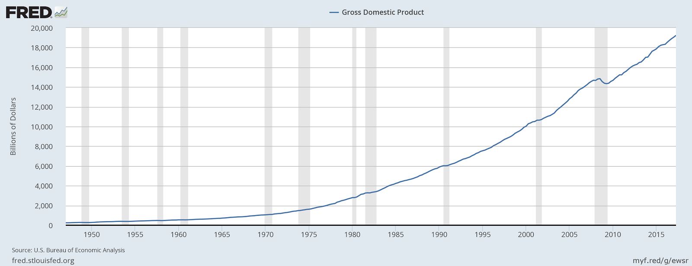
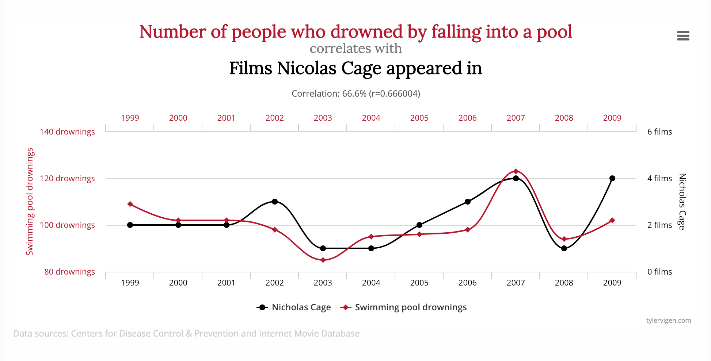

 
 
 

# We are done with bureaucracy!

notes:
last time we got a bunch of bureaucratic stuff (mostly) out of the way...

**make sure all notebooks are open now!! they take a while to load in the class wifi!**

---

 
 
 

# On to Viz topics!

notes:
now, lets actually discuss some viz stuff!

---

### Why any data viz course will feel a little weird

notes:
there is a *huge* overlay of topics that cover data viz - from the neurology of how your prefrontal cortex process information, to how humans process storytelling, to data analytics, and color theory and the list goes on!

---

### Why any data viz course will feel a little weird

notes:
this is another way of looking at this.

here is the overall diagram of the things we'll cover in this class -- you can see there are a lot of topics from different areas and they are all interconnected.

---

## Today

 * What is a visualization?
 * Why do we visualize?
 * What types of data do we visualize?
 * How do we visualize?

notes:
We're going to start out at a very high-level, discussing why we choose to
visualize versus other types of representation, what types of data, and how we
might do it.

---

# Class Mission

While you are already a _consumer_ of visualizations, your
perspective should change to that of a _producer_ of visualizations.
You should be comfortable reading AND writing imagery.

notes:
We will be discussing this as the semester goes on, but the principal outcome I
want you to take away from this class is understanding how to transform data
into its visual representation, and to take that understanding with you as you
observe visualizations presented to you.

By developing visualizations, you will grow to understand the choices that
influence those visualizations, and you will bring that with you while
consuming information visually.

---

# The Things I Want You To Take Away

 * You should know the basics of how to manipulate data -- aggregations,
   filterings, and other operations.
 * I want you to know _some_ of the packages that are out there to visualize
   data.  These will mostly be Python-based, with a couple in Javascript.
 * You won't learn how to use dashboarding software (e.g. Tableau) in detail. Instead, we
   will focus on the different operations that go into dashboarding software.
 * By the end of the course, you will have had the opportunity to look at and
   build visualizations in several different domains and understand how to
   interpret, critique and improve them.

notes:
This course *will* teach you some things about how to code, how to build
visualizations, but we're going to focus much more on learning about how to
construct visualizations and why we make the choices that we do.  If we choose
one way to present data, does that convey information more readily?  Or does it
get in the way of the underlying meaning?

---

## What is a visualization anyway?

"Computer-based *visualization* systems provide visual representations of datasets designed to help people carry out tasks more effectively."

   * Visualization Analysis & Design, Tamara Munzner

notes:
I really like this definition because it gives us a sense of purpose - i.e. that our visualization must help a human with a task that has to do with data.

---

## What is a visualization anyway?

"Computer-based *visualization* systems provide visual representations of datasets designed to help people carry out tasks more effectively."

   * Visualization Analysis & Design, Tamara Munzner

Data Viz is task oriented:

notes:
here for example, we might want to know the labels of bones or how they fit together

---

## What is a visualization anyway?

"Computer-based *visualization* systems provide visual representations of datasets designed to help people carry out tasks more effectively."

   * Visualization Analysis & Design, Tamara Munzner

... versus artistic representations used to convey emotions:

---

## What is a visualization anyway?

"Computer-based *visualization* systems provide visual representations of datasets designed to help people carry out tasks more effectively."

   * Visualization Analysis & Design, Tamara Munzner

... versus movies, comics, or other cinematic representations used to tell stories:

notes:
we will be using artistic concepts and elements of storytelling, BUT that is not our focus -- here we are TASK oriented.

---

# Why?

(Or rather, why _wouldn't_ we visualize?)

notes:
Not everything suits itself to visualization -- and part of the reason for that
is the necessary reductionism that visualization can require.

---

# We can't visualize everything

Peg + Cat:
https://www.youtube.com/embed/In72QAQJ1tY?rel=0

notes:
"There are lots of thing you can compare on a graph / Like who is the shortest
or the tallest giraffe / You can chart how much you walk / How much that you
laugh / There are lots of things you can compare on a graph"

"But the one thing you can't chart / Is how you feel in your heart"

---

# We can't visualize everything

Peg + Cat:
https://www.youtube.com/embed/In72QAQJ1tY?rel=0

"There are lots of thing you can compare on a graph / Like who is the shortest
or the tallest giraffe..."

notes:
"There are lots of thing you can compare on a graph / Like who is the shortest
or the tallest giraffe / You can chart how much you walk / How much that you
laugh / There are lots of things you can compare on a graph"

"But the one thing you can't chart / Is how you feel in your heart"

---

# We can't visualize everything

Peg + Cat:
https://www.youtube.com/embed/In72QAQJ1tY?rel=0

"But the one thing you can't chart / Is how you feel in your heart"

notes:
"There are lots of thing you can compare on a graph / Like who is the shortest
or the tallest giraffe / You can chart how much you walk / How much that you
laugh / There are lots of things you can compare on a graph"

"But the one thing you can't chart / Is how you feel in your heart"

---

# We can't visualize everything

notes:
for example, here is a haptic, or touch based "visualization" for the blind & visually impaired

---

# We can't visualize everything

notes:
you should check it out, because its a thing we are also not going to cover!

---

<!-- .slide: data-background-image="images/fov.svg" data-background-size="contain" -->

notes:
Visual information is communicated through our eyes, where it is processed.  At
the most basic level, we can see a range of about 210 degrees horizontally with
one or both eyes.  The region that is covered by both ("binocular") is about
114 degrees in extent.

You can only cram so much information into the human eye.

---

By Vanessa Ezekowitz [CC BY-SA 3.0](https://creativecommons.org/licenses/by-sa/3.0), via Wikimedia Commons

notes:
When we think about visual communication of information, we *must* think about
how human physiology interacts with that communication.

Also, fair warning: I'm not a medical doctor.

This diagram shows the visual acuity of a "standard" human eye, as a function
of angular distance from the fovea.  We have to think about this in
*conjunction* with our field of view.

---

# Your brain does interpolation

There are 12 dots, can you count them all at the same time?

(You should bring up the slides yourself to see these optical illusions)

---

# Your brain does interpolation

Step 1: Look at the cross

Step 2: Close left eye, keep looking at the cross

Step 3: Slowly move your head toward & away from screen until dot disappears

(You should bring up the slides yourself to see these optical illusions)

notes:
this only works if you have these slides on your own computer (but I can put this up over break if you want to test it on the screen!)

---

# Your brain does interpolation

Step 1: Look at the cross

Step 2: Close left eye, keep looking at the cross

Step 3: Slowly move your head toward & away from screen until dot disappears

# ... and sometimes it gets it wrong!

---

# Even so, the visual cortex is great for information transfer

Your visual cortex is processing information from different parts of this page AT THE SAME TIME which means it can do impressive things very quickly.

---

Can you spot the differences?

notes:
compare this to how long it would take to spot differences in 2 songs - you'd have to listen to both songs (probably more than once) and compare after!  This would be sequential rather than parallel data transfer!

---

# Try it with sound

* [Moonlight Sonota, 1](https://soundcloud.com/redreapergrell/beethoven-moonlight-sonata)
* [Moonlight Sonota, 2](https://soundcloud.com/user-37232775/sets/beethoven-moonlight-sonata)

Try doing the same thing with these on your own!

notes:
time this activity, give them 1.5 minutes

ask: how long did this take you?  How many differences were there?
I spotted tempo as one (but you can cheat by looking at the timer on the bottom!)

Also, you can look at how different each of the sound-bars are on each link and see how different the music looks visually!

---

# Visualization augments human data analysis capabilities

 * enhances our ability to pattern find
 * allows us to summarize data quickly
 * allows us to search our data quickly

---

## An example: Read this next table to yourself!

notes:
(This part is a bit of a stunt.  Sorry.)

---

*Read these numbers:*

| | |
|:-|-:|
| 2007-01-01 | 14233.2 |
| 2007-04-01 | 14422.3 |
| 2007-07-01 | 14569.7 |
| 2007-10-01 | 14685.3 |
| 2008-01-01 | 14668.4 |
| 2008-04-01 | 14813.0 |
| 2008-07-01 | 14843.0 |
| 2008-10-01 | 14549.9 |
| 2009-01-01 | 14383.9 |

notes:
See what I mean?  It's a stunt.  You're supposed to hear these, or look at the
numbers, and not have as clear an impression.  It also takes a lot longer.

Can you read the trends here at all?

---

notes:
You might immediately notice a few things about this image, but one item that
we will talk about as class goes on is that often visualizations can have a
consistent style.  FRED in particular has a "branding" that is quite obvious,
even without the logo.

Also, the data we read was in the last sort of gray area of this graph.

---

## Anscombe's Quartet

This famous example show's 4 datasets with the exact same mean, varience and correlation coefficient.

Statistics can be useful, but visualization generated context!

---

## Same thing but with a dinosaur

Statistics can be useful, but visualization generated context!

---

 
 
 

# A few final considerations.

---

# Who are you visualizing for?

* For yourself?
* For a peer?
* For someone else?

notes:
*Whenever* you build a visualization you need to think about the context that
you can assume on the part of your viewer.

We will talk about how your viz changes with audience in this course.

---

# Tenet 1:

"Visualizing data" is not a strict subset of "making an image."

 * Collection of the data
 * Organization of that data
 * Representation of that data

notes:
We will approach visualization as encompassing several different stages in the
collection, organization and representation of data.

---

# Tenet 2:

We tell lies to visualize, but we _must_ be honest. (Stuart Levy, AVL)

 * No representation is going to convey the entire complexity of a dataset.
 * Some representations are better than others.

---

### "The Principle of Proportional Ink" - callingbullshit.org

notes:
So let's first talk about how misleading visualizations can be. This 3D pie chart violates the "principle of proportional ink" which states that the number of pixels that represent a value should be proportional to the value. With the raised edge on the pie chart, the blue wedge gets way more ink than it deserves and you get a disproportionate sense of value.

---

### "Spurious Correlations" - tylervigen.com

notes:
you can have a lot of absurd fun with data - but when data is presented in a visualization, people often believe the authority of it even if it's outlandish. 

This guy has some good ideas of where to find sample datasets for upcoming homework assignments too!

---

<!-- .slide: data-background-image="images/barCharts.png" data-background-size="contain" -->

notes:
Each of these bar chart examples are meant to show the same data. But you can see how they're a bit problematic.

---

<!-- .slide: data-background-image="images/gunDeaths.jpg" data-background-size="contain" -->

notes:
Now here's an example that's more brazen. I'll give you a minute to analyze this and tell me what's wrong with this graph.

Some people will claim the Y-axis should always start from the bottom - at zero - to avoid confusion.

---

<!-- .slide: data-background-image="images/keelingCurve.svg" data-background-size="contain" -->

notes:
however, the Keeling Curve is an interesting counter-argument. This is the famous graph that was the original evidence for global warming, showing the rate at which atmospheric carbon dioxide was growing. 

Does anyone know why it's generally accepted to show the y-axis like this, without it starting at the zero axis?

---

<!-- .slide: data-background-image="images/hearts_battery.svg" data-background-size="contain" -->

notes:
here are a few more representations of data that you've probably run into!

---

<!-- .slide: data-background-image="images/battery.svg" data-background-size="contain" -->

 1. Sensors read the current "fill" of the battery
    * Analog / digital conversion
    * Normalized with respect to expected "full"
 1. This is then scaled to a percentage
 1. The battery image is filled from left to right
 1. The image is then rasterized and displayed

notes: what goes into this representation

---

<!-- .slide: data-background-image="images/hearts_bw.svg" data-background-size="contain" -->

 * Some fixed maximum amount of damage
 * Each time damage is taken, decrement
 * Each time damage is reversed, increment
 * Display number of hearts as appropriate

---

2 out of 3 "points"

<!-- .slide: data-background-image="images/hearts_color.svg" data-background-size="contain" -->

---

<!-- .slide: data-background-image="images/hearts_color.svg" data-background-size="contain" -->

---

<!-- .slide: data-background-image="images/stitch_bg.png" data-background-size="contain"-->

notes:
This is a screenshot from the movie "Lilo and Stitch" where the little girl Lilo is graphing how much evil is in the alien Stitch. It borrows from a familiar visual - the thermometer. But how could this visualization be misinterpreted? How is it different from a thermometer?

---

<!-- .slide: data-background-image="images/stitch_nobg.png" data-background-size="contain"-->

notes:
The angle can be misleading. So can the relative width of the head vs the feet. The surface area is not consistent from top to bottom. Also there are empty areas in the mouth and eyes!

---

<!-- .slide: data-background-image="images/stitch_nobg_tilted.png" data-background-size="contain"-->

notes:
If we rotate the image so that the red liquid is level, do we get a different impression for how much bad is in Stitch?

---

## Honesty

Our choices must be:

 * Deliberate
 * Informed
 * Motivated
 * Justifiable

---

## Election Maps

Mark Newman of the University of Michigan has created visualizations of the
election maps from several of the most recent elections.  For more information
and context, see his page http://www-personal.umich.edu/~mejn/election/2008/ .

 * [Map 1](http://www-personal.umich.edu/~mejn/election/2008/statemapredbluer1024.png)
 * [Map 2](http://www-personal.umich.edu/~mejn/election/2008/statepopredblue1024.png)
 * [Map 3](http://www-personal.umich.edu/~mejn/election/2008/countymapredbluer1024.png)
 * [Map 4](http://www-personal.umich.edu/~mejn/election/2008/countymappurpler1024.png)
 * [Map 5](http://www-personal.umich.edu/~mejn/election/2008/countycartpurple1024.png)

notes:
These are great, but some criticisms might be that the color red is more apparent to the human eye than the color blue. And in the population-to-area adjusted maps, it's difficult to read for people used to geographic accuracy.

Map1 - this is just a geographical map of red and blue

Map2 - cartogram weighted by population (note, NOT by electoral college population)

Map3 - election results by county

Map4 - percentage of votes by county

Map5 - percentage of votes by county, weighted by population

---

## Getting started in Python

*Let's check out the Python part of Homework \#1!*

notes:

**if taking a break -- fire up notebooks now!!**
 
* fire up the notebook with HW1 that has NO auto grading
* fire up the notebook with HW1 that DOES have autograding
* look at extra HW assignment problem -- varients
* look at the UNGRADED workbook -- if you want to follow along
* talk about installing locally

---

## This week: Wrap-up

 1. We visualize to change how we understand things.
 1. We visualize data for ourselves, for our peers, and for others.
 1. Visualization is a series of steps that we take to produce a different
    representation of data.

