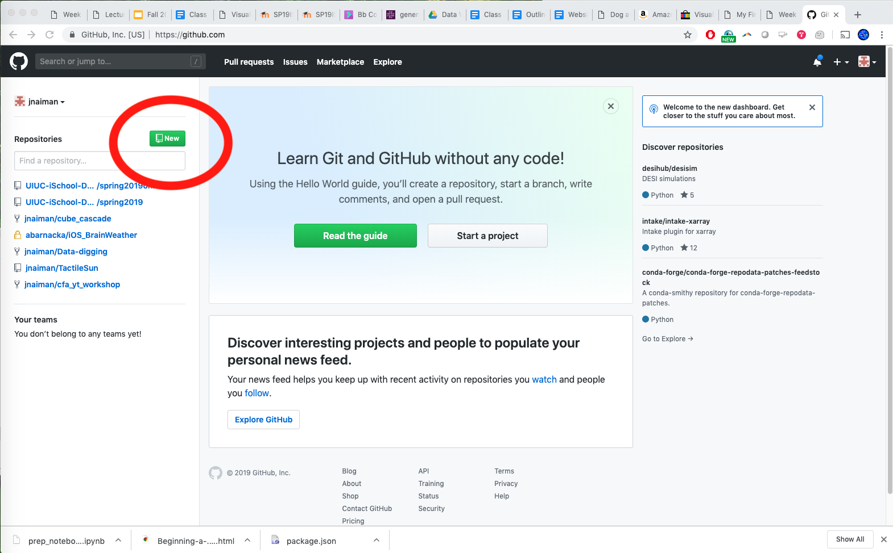
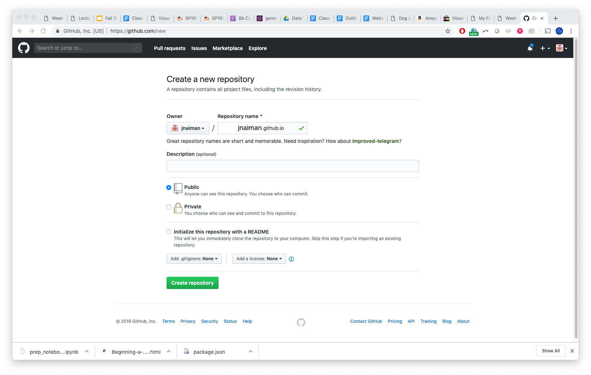
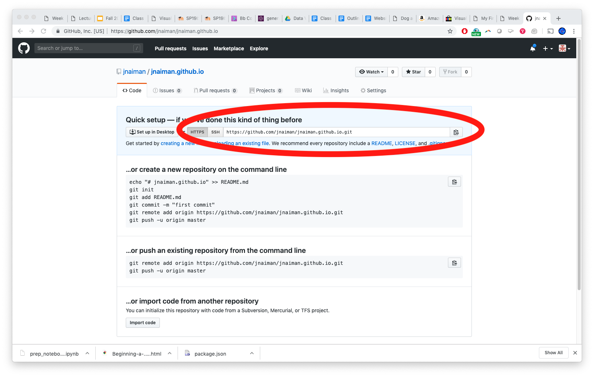
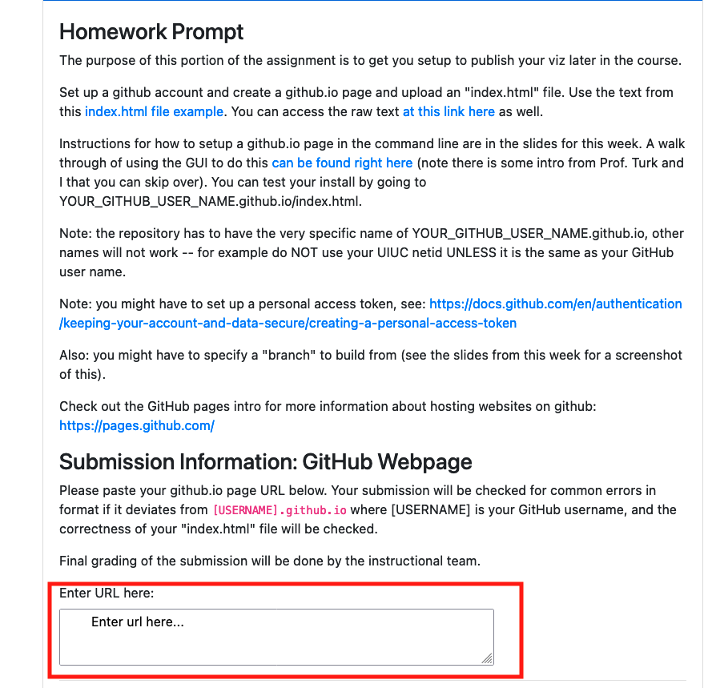
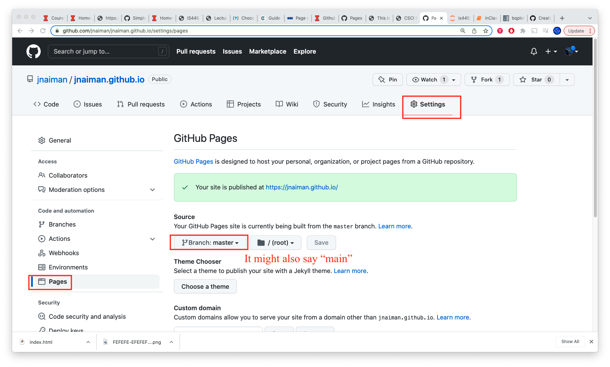

## Today's Main Topics

 * More with bqplot
 * A bit about Viz Engines
 * getting setup with github.io


notes:
some lecture, lab/homwork time!

---

# To bqplot!

---

<br />
<br />
<br />

# TOPIC 1: Vizualization Engines

notes: 
since we are starting to explore our first new viz engine, it is worth spending some time thinking about some questions we might want to ask our selves about said engines


---

## Evaluating Visualization Engines

 * Costs
 * Functionality
 * Aesthetics
 
notes: is this engine free or do you have to pay for it?  Does it do what I want?
Does its plots look like plots I want to make?

---

## Choices

 * Can I get ahold of this software?
 * Do I install it, or do I use it on a server?
 * What's the user interface like?
 * Is it declarative or is it procedural/imperative?
 
notes: in the HW you will look at several different forms of interfaces for making the same plot and thought a bit about how a user of the viz might go about making different plots and how some pathways to viz might be more or less intative for you and your given task 

---

## License: Software

 * What can you do with the software?
 * Can you study the software?
 * Who can you share it with?
 * Who can you give your derivative works to?
 
notes: while the viz engines we use in this class are generally open source, you may run into engines that are not or "somewhere in between"

In this case, you might have to think carefully about how you share your viz with others, you can use what you create? Can you actually study how the software works?

---

## License: Software

 * Copyleft: share and share-alike
 * Non-copyleft: share, but don't necessarily need to share-alike
 * https://choosealicense.com/
 
notes: this website has a bunch of "auto" generated licences, depending on what kind of license
you want *your* software to use

If you are ever in a position to create software, you can check this out to see what sorts of options you have.

Also, many of the open source packages we'll be using (including python) use a specific kind of license.  A lot of folks use the MIT licenses, fyi.

---

## License: Data

 * What can you do with the data?
 * How do you credit that data?
 * Can the data be redistributed, remixed, modified?
 * http://opendefinition.org/guide/data/
 * https://theodi.org/article/publishers-guide-to-open-data-licensing/

notes: additionally, the data that you chose to use might have a specific license.  So maybe you can use the data for your viz, but not share the data itself with others.

How can the data be modified?  Can you share the modified data?


---

## Accessibility

 * Is the software installed locally on your machine?
 * Is it hosted at a local or remote instance?
 * Who owns the visualizations, and how is access to them controlled?

---

## Interface

How do you interact with the software?

 * Declarative: how do you want the plot to look?
 * Imperative/Procedural: what are the steps to make the plot look that way?

---

## Evaluation: Costs

The "cost" of software is not exclusively the number of dollars you place on
the counter when you get a big cardboard box with marketing blurbs on the side.

Think about cost in several ways:

 * Monetary cost for *you* to use the software
 * Monetary cost for *someone else* to view your creations
 * Temporal cost of setting up
 * Cognitive cost for learning and using the system (documentation matters!)
 * Transmission cost for sharing your creations

---

## Evaluation: Aesthetics

Visualization is trendy.

When you construct something, think about the different ways it will be
interpreted:

 * How will the viewer understand the story of the data?
 * What will the _message_ of the visualization be?
 * Does the visualization say something about you and your handling of the data
   or utilization of tools?


---

<br />
<br />
<br />

# TOPIC 2: Getting setup with github.io

---

## github.io for publishing

Step 1: Create/login to your github account

notes:
(We'll also do this "live" in the coding section of class)

---

## github.io for publishing

Step 2: Create new repository


---

## github.io for publishing

Step 2: Create new repository



---

## github.io for publishing

Step 3: Name your new repository as ```[username].github.io```



---

## github.io for publishing

Step 3: Name your new repository as ```[username].github.io```


notes: the name is important here!!

---

## github.io for publishing

Step 4: Clone your repository


---

## github.io for publishing

Step 4: Clone your repository



notes: make note of your git name, we'll use this for "cloning" our github repo

---

## github.io for publishing

Step 5: Clone your repository
 * In command line do: ```git clone YOUR_REPO_LINK```

Step 6: Add an [index.html file](https://raw.githubusercontent.com/UIUC-iSchool-DataViz/is445_data/main/indexfile/index.html) to this new folder, for example:

```{html}
<!doctype html>
<html>
  <head>
    <title>This is the title of the webpage!</title>
  </head>
  <body>
    <p>This is an example paragraph. Anything in the <strong>body</strong> tag will appear on the page, just like this <strong>p</strong> tag and its contents.</p>
  </body>
</html>
```

---

## github.io for publishing

Step 7: Add files to your repo officially
 * ```git add -A```
 
Step 8: Commit these files (say what you are doing)
 * ```git commit -m "my first add"```
 
Step 9: Push to your online repo
 * ```git push```
 
Step 10: wait for your website to build and then check it out!
 * Link: ```https://YOUR_GITHUB_USER_NAME.github.io/```

---

## github.io for publishing

Step 7: Add files to your repo officially
 * ```git add -A```
 
Step 8: Commit these files (say what you are doing)
 * ```git commit -m "my first add"```
 
Step 9: Push to your online repo
 * ```git push```
 
Step 10: wait for your website to build and then check it out!
 * Link: ```https://YOUR_GITHUB_USER_NAME.github.io/```
 
**You can also use the GUI interface for this if you want!**

An example from a DPI talk Prof. Turk and I gave [can be found right here](https://mediaspace.illinois.edu/media/t/1_a874v3q7).

notes:
you can also use the GUI interface to do this if you are more comfortable with that

---

## github.io for publishing



notes:
you'll get some feedback instantaneously, and then the instructional team will give it a final once-over to make sure it is correct and input your final grade

---

## More info:

[https://pages.github.com/](https://pages.github.com/)


---

## Some things to keep in mind

 * You might have to set up a personal access token, see: https://docs.github.com/en/authentication/keeping-your-account-and-data-secure/creating-a-personal-access-token
 * You might have to specify a "branch" to build from: on your github.io code page go to Settings -> Pages and select "Branch:master"/"Branch:main" under "Source"




---

## Next week -- Prof. Jill out of town, "flipped" class for Lab \#4

In particular, I am assuming you have watched the [Part 2 Video](https://mediaspace.illinois.edu/media/t/1_k93hei8q) already before joining the class next week (video on Module page) *and* have looked at the prep notebook in Week 6.

**Extra online office hours with TA Qiuyan Guo (see class Zoom page).**

notes:
**change of modality next week!**

Qiuyan will have extra online hours during class time!

notes:
a remidner!
