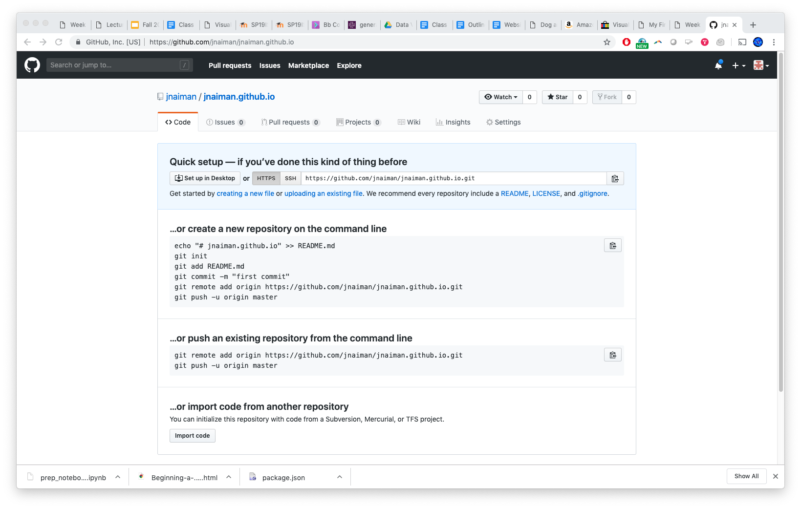

## Today's Main Topics

 * More with bqplot
 * getting setup with github.io


notes:
some lecture, lab/homwork time!

---

# Quiz \#3 Date Pushed Back (Viz Engines Covered Later)

(This means there will be 2 quizzes around the same time -- feel free to get started on Quiz \#3 now!)

notes:
last 2 questions of quiz 3 are on viz engines, but making time for more lab time today

---

# To bqplot!


---

<br />
<br />
<br />

# TOPIC 2: Getting setup with github.io

---

## github.io for publishing

Step 1: Create/login to your github account

notes:
(We'll also do this "live" in the coding section of class)

---

## github.io for publishing

Step 2: Create new repository


---

## github.io for publishing

Step 2: Create new repository


---

## github.io for publishing

Step 3: Name your new repository as ```[username].github.io```


---

## github.io for publishing

Step 3: Name your new repository as ```[username].github.io```


notes: the name is important here!!

---

## github.io for publishing

Step 4: Clone your repository



---

## github.io for publishing

Step 4: Clone your repository


notes: make note of your git name, we'll use this for "cloning" our github repo

---

## github.io for publishing

Step 5: Clone your repository
 * In command line do: ```git clone YOUR_REPO_LINK```

Step 6: Add an [index.html file](https://raw.githubusercontent.com/UIUC-iSchool-DataViz/is445_data/main/indexfile/index.html) to this new folder, for example:

```{html}
<!doctype html>
<html>
  <head>
    <title>This is the title of the webpage!</title>
  </head>
  <body>
    <p>This is an example paragraph. Anything in the <strong>body</strong> tag will appear on the page, just like this <strong>p</strong> tag and its contents.</p>
  </body>
</html>
```

---

## github.io for publishing

Step 7: Add files to your repo officially
 * ```git add -A```
 
Step 8: Commit these files (say what you are doing)
 * ```git commit -m "my first add"```
 
Step 9: Push to your online repo
 * ```git push```
 
Step 10: wait for your website to build and then check it out!
 * Link: ```https://YOUR_GITHUB_USER_NAME.github.io/```

---

## github.io for publishing

Step 7: Add files to your repo officially
 * ```git add -A```
 
Step 8: Commit these files (say what you are doing)
 * ```git commit -m "my first add"```
 
Step 9: Push to your online repo
 * ```git push```
 
Step 10: wait for your website to build and then check it out!
 * Link: ```https://YOUR_GITHUB_USER_NAME.github.io/```
 
**You can also use the GUI interface for this if you want!**

An example from a DPI talk Prof. Turk and I gave [can be found right here](https://mediaspace.illinois.edu/media/t/1_a874v3q7).

notes:
you can also use the GUI interface to do this if you are more comfortable with that

---

## github.io for publishing


notes:
you'll get some feedback instantaneously, and then the instructional team will give it a final once-over to make sure it is correct and input your final grade

---

## More info:

[https://pages.github.com/](https://pages.github.com/)


---

## Some things to keep in mind

 * You might have to set up a personal access token, see: https://docs.github.com/en/authentication/keeping-your-account-and-data-secure/creating-a-personal-access-token
 * You might have to specify a "branch" to build from: on your github.io code page go to Settings -> Pages and select "Branch:master"/"Branch:main" under "Source"


---

## Next week -- Prof. Jill out of town, "flipped" class for Lab \#4

In particular, I am assuming you have watched the [Part 2 Video](https://mediaspace.illinois.edu/media/t/1_k93hei8q) already before joining the class next week (video on Module page) *and* have looked at the prep notebook in Week 6.

**Extra online office hours with TA Qiuyan Guo (see class Zoom page).**

notes:
**change of modality next week!**

Qiuyan will have extra online hours during class time!

notes:
a remidner!
